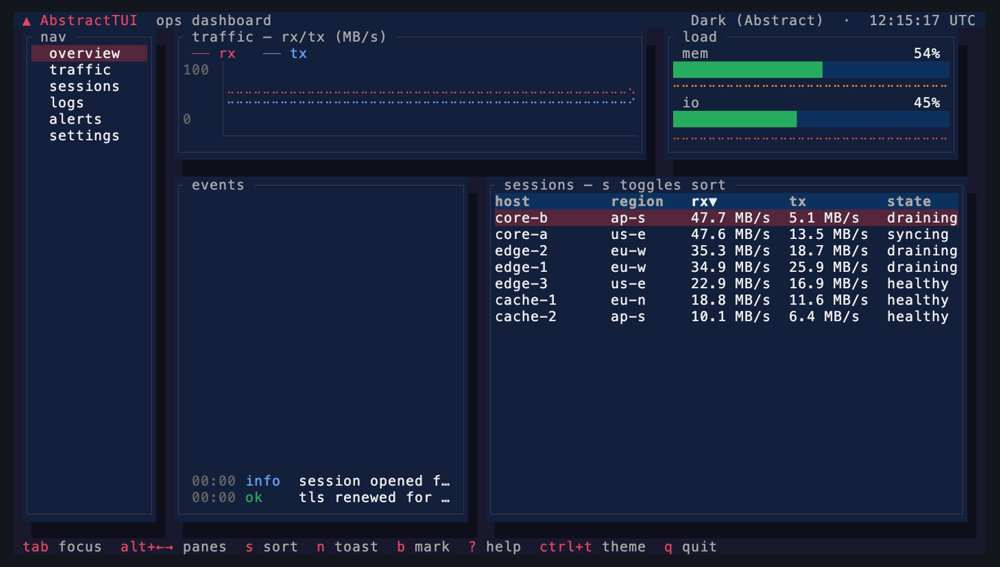
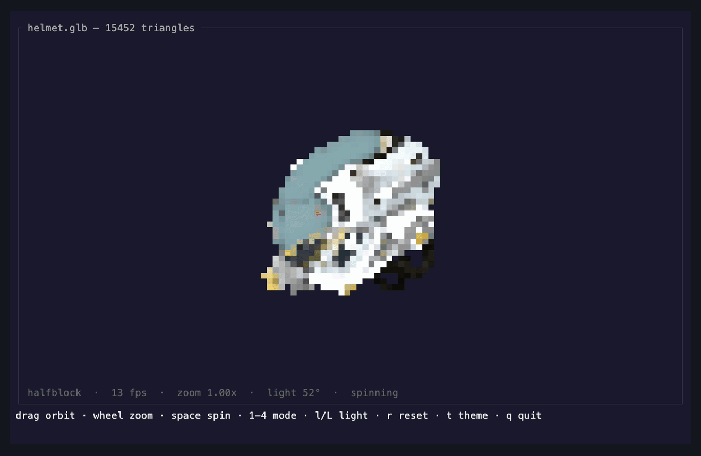
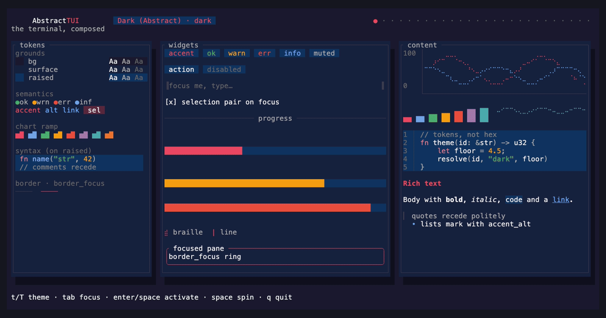

# AbstractTUI

**The terminal, composed.** A reactive, compositor-grade terminal UI engine for Rust.

AbstractTUI is built on fine-grained reactive signals — not immediate mode, not a
virtual DOM. Reading a signal inside a view tracks it; writing one re-runs exactly
the computations that depended on it, and those re-renders damage exactly the
screen regions they own. Damaged regions flow through a real compositor
(z-ordered layers, alpha blending, per-layer offset/opacity), a frame diff, and a
byte emitter that plays the terminal like an instrument — cursor-motion economy,
minimal SGR runs, synchronized output where the terminal supports it. The result:
an idle app emits zero bytes and allocates nothing, and a blinking cursor repaints
one cell, not the screen.



*The `dashboard` example — live line charts, sub-cell progress bars, a
software-rendered 3D mark, a scrolling event log, a sortable table, toasts and a
modal, all animating while the rest of the screen stays still.*

### 3D in the terminal — a real GLB, rasterized to cells



*`cargo run --example viewer3d` turning [the standard damaged-helmet glTF
model](https://github.com/KhronosGroup/glTF-Sample-Models) (15,452 triangles) —
a hand-written perspective rasterizer with a z-buffer, textures and lighting,
presented through half-block, quadrant, sextant and braille mosaics. No GPU, no
external renderer.*

### The design system on one screen — restyled under one keypress



*The `gallery` example — every token, widget state, chart, and text style on one
board. Pressing a key swaps the theme signal and the whole screen re-renders
through ordinary reactivity.*

## Highlights

- **Widgets + layout** — buttons, text inputs, a multiline composer
  (`TextArea` with history and completion dropdowns), selects (`Select` /
  `Combobox` / `MultiSelect` over anchored popups that layer above modals),
  lists and sortable tables with distinct selection and activation events,
  tabs, checkboxes, radio groups, scroll regions, panels, badges, progress
  bars, spinners, modals, toasts, tooltips — arranged by a flexbox-style solver
  (row/column, `grow`, `gap`, padding) and a track-based grid
  (`fr`/cells/percent, spans).
- **Transcripts and documents** — `Feed` renders append-only conversations
  and logs with keyed rich blocks (markdown, code with syntax and diff
  tinting, multi-ink rich lines, custom draw); streaming markdown items
  re-typeset only the open block per token and speak the full doc
  vocabulary — GFM tables (a streamed table renders as a table live), task
  lists, strikethrough, and lazy in-flow images. `MarkdownView` adds the
  reading surface: heading outline with anchor jumps, and find-in-document
  with highlighted matches. `Scroll::follow_tail` pins to the bottom until
  the user scrolls and re-pins at the edge.
- **Live data** — feed the UI from background threads through
  `channel_source` / `latest_source` / `bounded_source` (drop or coalesce
  policies with honest drop counters), a cancellable `interval` timer, and
  waker deduplication; `TimeSeries` history rings put relative time axes
  under the charts (a sampling pause draws as a hole, never a compressed
  x-axis), and `reactive::connection` owns the reconnect lifecycle with
  jittered exponential backoff. An idle app still costs zero — offline
  included.
- **Selection + clipboard** — drag to select rendered text (wide-glyph safe,
  pane-clamped), copy via OSC 52; or suspend mouse capture for native
  terminal selection.
- **26 built-in themes** — catppuccin, rose-pine, tokyo-night, nord, one-dark,
  dracula, monokai, gruvbox, solarized, everforest and the Abstract originals —
  over 36 semantic design tokens, contrast-audited against WCAG floors, and
  hot-swappable at runtime through one signal.
- **Input everywhere** — keyboard and mouse (click, hover, drag, wheel), the
  kitty keyboard protocol and xterm modifyOtherKeys decoded automatically when
  present, bracketed paste hardened against multi-megabyte and hostile input,
  focus events, key chords with modifiers.
- **Voice and AV plumbing** — key press/release state with honest fidelity
  (true hold detection where the terminal reports releases; never a
  fabricated "held" on legacy wires), a `PushToTalk` gesture built on it
  (hold-to-talk, labeled latch fallback, capture stops on focus loss), and
  `Meter` / `AudioScope` widgets that render live levels with real
  ballistics and go fully idle when the signal does.
- **Images** — PNG and baseline JPEG decoding built in, drawn through the best
  channel your terminal offers: kitty graphics, iTerm2, sixel, or unicode mosaic
  (half-block / quadrant / sextant / braille). Capability detection is automatic
  and every degradation is labeled, never silent.
- **Software-rasterized 3D** — load GLB files (node hierarchies, textures,
  vertex colors, animation, skinning) and render them into the same cell
  pipeline. No GPU, no native dependencies.
- **Motion** — cell shaders (shimmer, dissolve, hue-drift, and more) that cost
  work only where damage exists, plus tweens, easings, and timelines.
- **A boot identity** — a 2-second animated splash (3D mark with a pure-cell 2D
  fallback), skippable with any key, auto-disabled on non-TTY, `NO_COLOR`, and
  `TERM=dumb`.
- **Headless testing** — drive the production pipeline against a captured
  terminal and assert on the rendered screen. No pty required.

## Your first app

Sixteen lines, one import:

```rust
use abstracttui::prelude::*;
use abstracttui::widgets::Button;

fn main() -> abstracttui::base::Result<()> {
    App::simple(|cx| {
        let count = cx.signal(0);
        Element::new()
            .style(LayoutStyle::column())
            .child(dyn_view(LayoutStyle::line(1), move || {
                text(format!("count: {}", count.get()))
            }))
            .child(Button::new("+1").on_click(move || count.update(|c| *c += 1)).view(cx))
            .child(text("Tab focuses · Enter clicks · Ctrl+C quits"))
            .build()
    })
}
```

Tab focus, Enter/Space activation, and Ctrl+C quit are all defaults. The count
line re-renders fine-grained through `dyn_view` — nothing else repaints. The
walkthrough lives in [docs/getting-started.md](docs/getting-started.md).

## Install

```sh
cargo add abstracttui
```

Rust 2021 edition. The dependency policy is deliberately austere — `unicode-width`,
`unicode-segmentation`, `miniz_oxide`, plus `libc` on unix / `windows-sys` on
Windows, and nothing else. ANSI emission, input parsing, the layout solver, the
signals runtime, PNG/JPEG decoding, glTF parsing, and the 3D rasterizer are all
implemented in-crate.

## Run the examples

```sh
git clone https://github.com/lpalbou/abstracttui
cd abstracttui
cargo run --example dashboard
```

Sixteen runnable examples live in [examples/](examples/README.md), and every one
exits cleanly with a notice when no interactive terminal is present, so they are
safe to run anywhere. Start with these five:

- `dashboard` — the flagship ops screen: charts, log tail, sortable table,
  toasts, modal help, spatial pane navigation.
- `gallery` — the whole design system on one screen; one keypress restyles it.
- `themes` — every theme as a live card grid with a preview pane and measured
  contrast ratios.
- `viewer3d` — orbit a GLB model with measured fps
  (`cargo run --example viewer3d -- path/to/model.glb`).
- `images` — four mosaic families side by side, dithering, and pixel-protocol
  placement with the chosen channel named.

`ABSTRACTTUI_THEME=rose-pine cargo run --example hello` themes any example from
the environment; `--caps` on `dashboard`, `viewer3d`, and `images` prints the
detected capability report and exits.

The animations above are recorded straight from these examples with
[`vhs`](https://github.com/charmbracelet/vhs); the tapes live in
[`docs/media/`](docs/media/) and regenerate with `vhs docs/media/<name>.tape`.

## Platform support

| Platform | Status |
| --- | --- |
| macOS | Verified — the full test suite includes live pty tests (real controlling terminal, signal-driven resize, suspend/resume). |
| Linux | Verified — same unix code paths; the full default suite runs in CI on ubuntu, and the live pty suite runs in a dedicated CI job (`live pty (ubuntu)`, real pseudo-terminal, examples prebuilt). |
| Windows | Best-effort — compiles clean and lint-free against the MSVC target, the library suite runs in CI on a real Windows runner, but it has not yet been run on a live Windows console. Treat the first Windows run as a beta event. |

Minimum supported Rust version: **1.87** (declared as `rust-version` in
Cargo.toml and checked by a pinned-toolchain CI job; raising it is a
minor-version event, declared in the CHANGELOG).

The terminal is always restored — on quit, on panic, and on Ctrl+Z suspend —
including cursor style, mouse modes, and kitty keyboard flags.

## Performance

Measured (release build, M-class laptop): a full 200×60 diff+present costs
~0.5 ms, a keystroke reaches the painted frame in ~50 µs through the real event
loop, and an idle app costs zero — zero bytes written, zero heap allocations,
zero wakeups. The allocation budgets gate every CI run; the release-mode
timing budgets and byte-emission ratchets gate on a weekly scheduled job
(`perf.yml`, also runnable by hand — see CONTRIBUTING) — budgets, not
aspirations, with the honest split stated.

## Documentation

- [Getting started](docs/getting-started.md) — install to first pixels, step by step.
- [Architecture](docs/architecture.md) — signals, damage, the compositor, the render pipeline.
- [API guide](docs/api.md) — the public surface, module by module.
- [Live data](docs/live-data.md) — background threads into the UI, bounded and honest.
- [FAQ](docs/faq.md) and [Troubleshooting](docs/troubleshooting.md).
- [Examples catalog](examples/README.md) — what each demo proves and the keys it answers to.
- API reference on [docs.rs](https://docs.rs/abstracttui).

## License

MIT — see [LICENSE](LICENSE).
