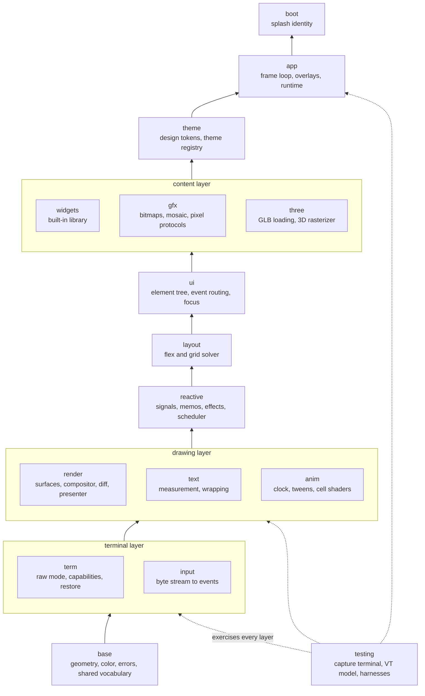
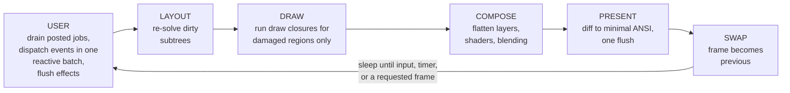

# AbstractTUI Architecture

AbstractTUI is a standalone Rust engine that treats the terminal as a real
display device. A layered compositor with damage tracking sits under a
fine-grained reactive component model; pixel graphics and software-rasterized
3D are first-class citizens of the same scene, themed by a shared design-token
system.

Most terminal UI stacks pick one of two camps: immediate mode, which rebuilds
the whole frame every tick and diffs it, or retained widget trees with coarse
invalidation. AbstractTUI takes a third architecture. State lives in signals;
a write re-runs exactly the computations that depended on it, and those
computations damage exactly the screen regions they own. There is no virtual
DOM to diff and no full-frame rebuild to pay for. An idle application burns
zero CPU; a blinking status cell damages one cell.

## Layer map

Every module sits at a fixed layer and depends only on layers below it. The
`testing` module cuts across the whole stack: an in-memory terminal double
and a VT100/xterm interpreter let any layer be exercised headlessly against
ground truth.

The engine is deliberately standalone. Runtime dependencies are limited to
`libc` (unix), `windows-sys` (windows), `unicode-width`,
`unicode-segmentation`, and `miniz_oxide` (PNG inflate). ANSI emission, input
parsing, the flexbox solver, the signals runtime, JSON parsing (for glTF),
PNG chunking and defiltering, base64, sixel encoding, and the 3D math and
rasterizer are all implemented in-crate.

Above the crate sits one more deliberate layer: the **sibling-crate
extension family** ([ADR-0004](adr/0004-extension-packaging.md)).
Genuinely new domains — graph layout + rendering
(`abstracttui-graph`), mermaid diagrams (`abstracttui-mermaid`) —
ship as separate crates in an in-repo cargo workspace
(`extensions/*`), built and tested against core HEAD in CI but
installed by downstreams only when needed. Extensions consume the
PUBLIC API exclusively (the same "no private engine privileges" rule
the built-in widgets live under); a capability an extension needs and
cannot reach is, by definition, a core backlog item. They inherit the
dependency posture (hand-rolled parsers, std + the family), the token
discipline, and the honest-degradation principle; publish order is
core first, family the same day. The family guide is
[graphs-and-diagrams.md](graphs-and-diagrams.md).

## Pillar 1: fine-grained reactivity

The `reactive` module implements signals, memos, and effects with ownership
scopes, in the SolidJS tradition rather than the React one. Reads are tracked:
while a computation runs, every `Signal` it reads records an edge to it. A
write marks direct observers dirty and transitive observers for re-check,
then flushes queued effects — immediately after the write, or once at the end
of a `batch`. Each effect pulls its sources up to date before running, so it
observes a single consistent world (diamond dependencies cannot glitch).
Memos recompute lazily and stop propagation when the new value compares equal.

Ownership scopes tie state to component lifetime: signals, memos, effects,
and cleanups created on a `Scope` die when that scope is disposed, which is
what happens when a dynamic view region unmounts. The UI consequence is the
important one: components are plain functions that run **once** to build a
view blueprint. Reactivity lives in `dyn_view` regions that re-run when the
signals they read change — a parent never re-renders a child, and there is no
tree diff. A changed region marks damage for exactly the cells it owns.

Draw closures are pure over data captured at view-build time; reading a
tracked signal inside a draw closure is a debug-mode panic. This is what
keeps the frame model (below) airtight: painting cannot create new damage.

Background threads reach this world through the live-data lane
(`channel_source`, `latest_source`, `bounded_source`, `interval`): producers
post values, a waker coalesces any burst into one wakeup, and the bound
signal is written on the UI thread at the next frame's update phase — the
single-writer rule is preserved by construction. Overflow policies and drop
counters keep back-pressure honest. Reconnect rides the same lanes:
`reactive::connection` owns the connection state machine and its jittered
retry schedule (`Backoff`), with worker reports crossing on the posted-jobs
lane and retries armed on the timer heap — offline costs zero wakeups until
the retry is due. See [Live data](live-data.md).

## Pillar 2: the compositor

The `render` module owns everything between "widgets wrote cells" and "bytes
reached the terminal":

- **Z-ordered layers.** Each layer is a cell surface with an offset, opacity,
  a blend mode, an optional color transform, and an optional per-cell shader.
  Animations translate or fade whole layers without re-rendering their
  content.
- **Blending.** Colors are RGBA. `Blend::Normal` is source-over;
  `Blend::Additive` accumulates light (for glows, particles, scanline
  highlights). Alpha means transparency while compositing, and "terminal
  default color" once a frame reaches the presenter.
- **Per-cell shaders** transform cells as a pure function of `(x, y, t, cell)`.
  Shaders are billed by damage: a shader runs only where damage exists, so a
  static shader is paid once at install and never again. An animated shader
  is an animation — advancing its clock damages what the shader's
  `changed_region` hint declares (default: the whole layer) and requests the
  next frame like any tween. The hint contract is stability outside the
  declared rect, property-tested for every built-in shader.
- **Damage tracking.** Every draw records its own damage automatically.
  Damage may honestly over-approximate: the diff re-checks equality, so stale
  damage costs microseconds, never wrong pixels.
- **Frame diff and presentation.** The flattened frame is diffed against what
  the terminal currently shows, producing minimal runs. The presenter turns
  runs into byte-economical ANSI: cursor-motion economy, SGR run
  minimization, truecolor with 256/16-color downlevel, DEC 2026 synchronized
  output so frames land atomically, and a scroll-region optimization that
  detects full-width band shifts (log append, list scroll) and replays them
  as DECSTBM scroll commands instead of repainted rows. All bytes are
  buffered and flushed to the terminal exactly once per frame.

All output flows through the presenter — including foreign payloads. Image
protocols emit through `Presenter::external_write`, which flushes pending
runs, positions the real cursor, emits the payload, and invalidates cursor
and SGR assumptions afterward. Nothing writes to the terminal behind the
presenter's back.

## Pillar 3: capability-driven graphics

The `gfx` module serves bitmaps through the best channel the terminal
actually offers, on an explicit quality ladder:

1. **kitty graphics** — upload once by id, place and move by escape, true
   deletion;
2. **iTerm2** (OSC 1337) — full base64-PNG re-emit at the cursor;
3. **sixel** — paletted raster at the cursor;
4. **unicode mosaic** — colored half-block, quadrant, sextant, or braille
   glyphs, with optional dithering. This is plain cells, so it works on any
   terminal and composites like any other content.

Which channel applies is decided by detected capabilities, never by
assumption, and every degradation is labeled with a reason rather than
applied silently — `MosaicMode::auto` returns both the chosen mode and why.
The `three` module renders into the same pipeline, so a 3D viewport and a
PNG follow identical presentation rules.

## The frame lifecycle

The application runtime drives one strictly-sequenced pass per frame on the
UI thread:

User code runs only in the USER phase. Input dispatch is wrapped in one
reactive batch; effect flush is where dynamic views remount and layout
re-solves are requested. From LAYOUT onward no user code runs, therefore no
signal writes, therefore no re-entrant damage: the frame's damage set is
sealed when LAYOUT begins. Signal writes from other threads arrive only as
posted jobs, and posted jobs run only in the USER phase — a write landing
mid-frame wakes the loop and is drained by the next frame. Late damage is
never lost and never double-painted, by construction rather than by
discipline. One engine-owned addition happens inside DRAW itself: an image
pre-pass folds the rects vacated by moved or removed image placements into
the frame's damage (and, where a byte protocol left pixels the cell model
cannot see, poisons the previous-frame model so the diff re-emits them) —
deterministic driver bookkeeping, not user code, so the seal against
re-entrant damage stands.

The cursor follows the same economy. The default is the terminal's native
cursor, parked by the presenter, so a focused-but-idle text field costs
nothing. A composited or animated cursor is an animation: it requests frames
and is billed as one.

## The damage promise

The frame model rolls up into one product guarantee:

> **An idle AbstractTUI app costs zero: zero bytes written, zero heap
> allocations, zero shader work.**

This is enforced by tests, not stated as an aspiration. In-tree tests pin
each clause: an idle frame emits zero bytes
(`render::present::tests::zero_runs_zero_bytes`, and the third frame of
`render::pipeline_tests::full_pipeline_small_damage_small_bytes`), a
no-change frame allocates nothing
(`alloc_budget::presenter_no_change_frame_emits_and_allocates_nothing`),
steady-state diff and present allocate nothing
(`alloc_budget::diff_present_steady_state_allocates_nothing`), a static
shader on an idle layer performs zero shade calls
(`render::compositor::tests::shader_runs_only_for_damaged_cells_and_never_when_static`),
and the guarantee holds through the whole app layer with the modern
mounts in play — a streaming `Feed`, an armed `interval`, a parked
`Select` popup, a parked protocol image — where sixteen idle turns
through the real driver allocate nothing and write nothing
(`alloc_budget::idle_turns_with_feed_interval_parked_popup_and_parked_image_allocate_nothing`),
and again with the AV surfaces mounted — a settled `Meter`, a quiet
`AudioScope`, armed key state, and a bound push-to-talk
(`alloc_budget::idle_turns_with_parked_meter_scope_and_key_state_allocate_nothing`).

Idle really means idle: the event loop blocks in a terminal read with zero
wakeups until input, a resize, a cross-thread wake, or a timer deadline
arrives. Animations never poll — an active animation requests one more frame
through the scheduler and simply stops asking when it settles, and each
animated layer is billed for exactly the damage it declares.

The active path is budgeted too: diff plus present of a full-change 200x60
frame runs in roughly 450 microseconds median on an M-class laptop, and the
steady-state hot path performs no heap allocation. The irreducible byte cost
of truecolor styling is the SGR payload itself; 256-color caps are the lever
for byte-constrained links.

## The terminal layer

The `term` and `input` modules are the platform boundary, kept small enough
to audit line by line. The posture:

- **Raw mode and session lifecycle.** `enter` switches to raw mode, the
  alternate screen, and the requested modes; `leave` undoes everything in
  exact reverse order. Restore is layered three deep: explicit `leave`,
  `Drop` if you forget, and a process-global `term::emergency_restore` for
  panic hooks. Cursor style, window title, pixel-mouse mode, and kitty
  keyboard flags are all tracked and reset — including from a panic.
  `App::run` installs the panic hook before anything else, so a panic in any
  draw closure or handler still restores the screen.
- **Capability detection is evidence, not folklore.** Detection runs in two
  passes: an instant, conservative environment pass for the first frame,
  then an active query probe that runs concurrently and can both raise and
  lower the answer — a terminal that replies "mode not recognized" is
  believed. Color depth, kitty keyboard and graphics, sixel, synchronized
  output, cell pixel geometry, and pixel-mouse support are all probed with
  safe timeouts. `NO_COLOR` and `TERM=dumb` are honored.
- **Kitty keyboard protocol.** Progressive enhancement flags are pushed on
  enter and popped on leave. Under the kitty protocol (or xterm's
  modifyOtherKeys) the engine decodes press/repeat/release and chords such
  as Ctrl+Enter or Shift+Enter that are byte-identical to plain Enter on the
  classic wire. Applications should treat those chords as enhancements;
  arrows, Home/End, PgUp/PgDn, and F1-F12 with any modifier combination are
  reliable everywhere.
- **Mouse, including pixel coordinates.** SGR mouse tracking delivers cell
  coordinates always; raw pixel coordinates ride alongside only when pixel
  reporting is verifiably active. Pixel reporting is a mid-session toggle
  (applications flip it while a pointer hovers an image), with the same
  latch-and-restore machinery as the cursor style.
- **Bracketed paste is the only paste path.** Paste is fuzz-hardened:
  multi-megabyte pastes stream in bounded chunks, byte-exactly, with
  embedded escape sequences neutralized as content. Copy-to-clipboard uses
  OSC 52, gated on detection; the read form of OSC 52 is deliberately never
  emitted — it would let any application read the user's clipboard.
- **Keyboard input is never silently dead.** If the platform refuses to poll
  the terminal descriptor (a real macOS quirk with `/dev/tty` that the
  engine detects and avoids), the reader falls back to a working descriptor
  with a labeled degradation surfaced through startup notices, or fails with
  an actionable error. An app that starts is an app that receives keys.
- **One event stream that never lies.** Keys, mouse, paste, focus, resize,
  and terminal query replies arrive ordered through one reader. Unknown or
  hostile escape sequences are swallowed and surfaced as `Unknown` events —
  foreign bytes cannot forge keystrokes; the parser never panics on any
  input and is continuously fuzzed. Resize comes from platform ground truth
  (never parsed from bytes), is deduplicated, and is re-checked on every
  wake so a missed signal cannot leave a stale layout.
- **tmux, honestly.** Inside tmux, pixel graphics are off by default because
  tmux swallows the protocols unless passthrough is enabled — which is
  invisible from the environment. The engine verifies passthrough per
  session with a wrapped round-trip probe and only then enables the kitty
  and iTerm2 paths, wrapped automatically. tmux cannot reflow passthrough
  images across scrolling or pane splits; that limit is cosmetic and stated.
- **Suspend/resume is a first-class verb** on unix: full restore, stop the
  process group, re-enter on resume. On Windows it returns an explicit
  `Unsupported` error.

## The 3D pipeline

The `three` module loads binary glTF (GLB) with a validation-first posture:
typed accessors are checked against the buffers they index, unsupported
features are rejected by name (sparse accessors, Draco and meshopt
compression, non-triangle primitive modes), and recoverable gaps degrade
with labels (external URIs, normal/metallic-roughness/occlusion maps, morph
weights). A two-million-triangle budget is enforced from metadata before any
allocation happens.

Rendering is a software perspective rasterizer: near-plane and guard-band
clipping, top-left fill rule, z-buffer, perspective-correct depth and UVs,
lambert-plus-ambient shading, base-color textures with a box-filter mip
chain. Node TRS and matrix hierarchies animate via LINEAR and STEP keyframe
tracks; skinned meshes blend up to four joints per vertex. Pose sampling is
pure in `t` and allocation-free at steady state, so playback costs are
predictable. Output lands in an RGBA framebuffer that flows through the same
image ladder as any bitmap — mosaic cells universally, pixel protocols where
the terminal proves them. A model of 20k triangles or fewer renders in under
2 ms at typical viewport sizes; ~120k triangles holds 30 fps with headroom
on one core (reproduce with
`cargo test --release -- --ignored perf_three_envelope --nocapture`).

## Platform posture

macOS and Linux are the verified platforms. Every unix code path is exercised
by a live pseudo-terminal test suite — signal-driven resize, job-control
suspend, and keystroke flow under a real controlling terminal — and tmux
passthrough has been proven live against tmux 3.7b.

Windows support is best-effort and honestly labeled: the backend compiles
cleanly and is lint-clean against the MSVC target, its platform-independent
logic (UTF-16 surrogate pairing, wake latching, resize deduplication) is
unit-tested on every host, and its console usage was written against
Microsoft's documented semantics — but it has not yet executed on a live
Windows machine. Treat the first Windows run as a beta event, not a
certified path. The rendering path itself is identical ANSI everywhere
(Windows 10+ VT processing), so the platform delta is confined to the
terminal layer.

Diff/present correctness is property-tested against the in-crate VT
interpreter: the bytes the presenter emits, applied to the previous screen,
must reproduce the intended screen — including wide-glyph pairs at scroll
boundaries. The input parser is fuzzed with hostile corpora on every build.
