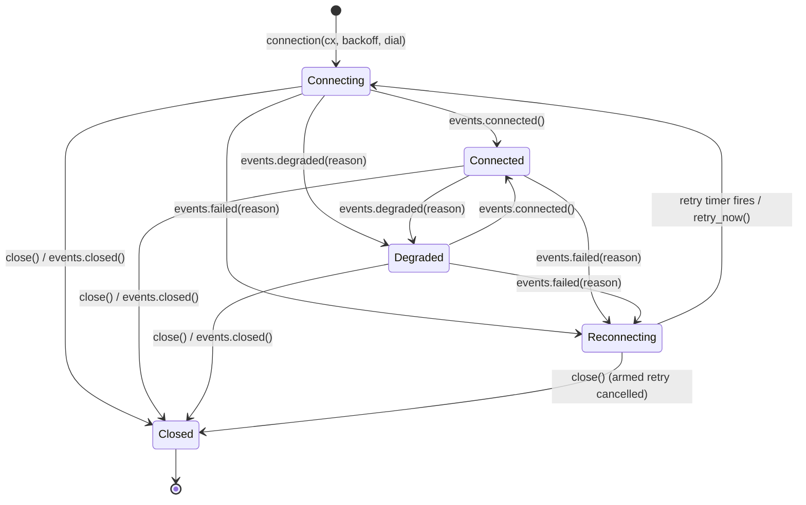

# Live data: background sources into the UI

How a networked, long-lived app gets data from a background thread into
signals — the ownership rule, the named bindings, bounded back-pressure,
and the recurring time source. The runnable companion is
[`examples/feed.rs`](../examples/feed.rs).

## The ownership rule (one sentence)

The reactive graph is single-threaded: background threads never touch
signals — the only sanctioned crossing is a closure posted to the UI
thread, and writing a signal from the wrong thread is a **named panic**
(it tells you to use this page's pattern), never silent aliasing.

Under the hood that crossing is `reactive::WakeHandle::post(f)`: the
closure crosses the thread boundary, wakes the event loop, and runs in
the next frame's phase U with full runtime access. Two guarantees come
with it:

- **Ordered delivery** — one producer's posts apply in emit order
  (FIFO; cross-producer order is lock-acquisition order).
- **One frame per burst** — any number of posts between two frames
  coalesce into one wake and one repaint; a post landing mid-frame
  applies in the next frame, exactly once.

And one cost rule: while a source is quiet, the app is byte-for-byte
idle — no polling, no timers, the loop parks in a blocking read.

## The bindings

You rarely post by hand. Three named helpers in `reactive::` cover the
shapes (all senders are `Clone + Send`; all signals die with the scope
that created them, after which senders turn **inert** — sends apply
nothing, count on `dead_sends()`, and are never unsafe):

| helper | signal shape | delivery | use for |
| --- | --- | --- | --- |
| `channel_source(cx)` | `Signal<Vec<T>>` | every value, in order, unbounded | low-rate event streams |
| `latest_source(cx, initial)` | `Signal<T>` | newest value; intermediates coalesce at the source | progress, telemetry, presence |
| `bounded_source(cx, capacity, policy)` | `Signal<Vec<T>>` window + `Signal<IngestStats>` | at most `capacity` retained; overflow per policy, counted | anything that can flood |

## Bounded ingestion and back-pressure honesty

`WakeHandle::post` is the **control lane**: unbounded by contract,
correct for low-rate messages. A flooding producer (chat hub, tool
output, tail -f) needs the **data lane**:

```rust
let (tx, events, stats) = bounded_source::<String>(
    cx,
    400,                        // the retained window, and the bound
    OverflowPolicy::DropOldest, // what overflow MEANS is the app's call
);
```

- `DropOldest` — ring: the newest tail survives (feeds, logs).
- `DropNewest` — the head survives (capture the first N).
- `OverflowPolicy::coalesce(fold)` — overflow merges into the newest
  survivor (progress updates that supersede each other). A fold that
  PANICS degrades labeled instead of poisoning the lane: the panic is
  caught, the value it consumed counts as `dropped`, the event counts
  as `fold_panics`, and later sends keep working.
- **There is no `Block`.** Blocking a producer against the UI thread
  inverts liveness: the producer inherits every UI stall (a held
  scrollbar, a suspended terminal, a modal) as unbounded latency on its
  own sockets and locks, and can no longer answer the cancellation the
  UI is about to send it. Producers that must not lose data pause their
  *reads* upstream (the transport pushes back); they never park on the
  UI.

Honesty is part of the contract: every value lands in exactly one
bucket of `stats` (`IngestStats { delivered, dropped, coalesced,
fold_panics }` — the last counts events, its values are inside
`dropped`), updated atomically with the window. **Render `dropped`
(and `fold_panics`) when nonzero** — "1.2k shown · 34 dropped" is the
labeled-degradation convention; silent loss is the failure mode this
lane exists to prevent. `delivered + dropped + coalesced` always equals
values sent; a `DropOldest` window aging out an already-shown item is
retention churn, deliberately not re-counted as a drop. Memory is
bounded by construction (≤ 2×capacity across the transit buffer and
the window) and a burst costs one wake, one posted drain, one frame —
no matter how many values arrive.

Producer-side guidance: drain everything available per read and send
per item into the bounded lane (it batches internally), or batch into
few `post` closures on the raw lane. One closure per burst is the
intended cadence for high-rate sources.

## The recurring time source

Time is the zeroth data source. `reactive::interval` is the engine-owned
version of the self-rescheduling `after(..)` recursion, with the
cancellation story the recursion never has:

```rust
let handle = interval(cx, Duration::from_secs(1), move || {
    now.set(clock_text()); // runs on the UI thread, phase U
});
// handle.cancel() stops it early; scope disposal cancels it anyway —
// a closed pane's poller cannot keep ticking by accident.
```

Fixed-delay drift policy: the next deadline is *fire time + period*.
After a suspend of N periods it fires **once** and resumes cadence —
missed ticks coalesce, there are no catch-up storms. Between fires an
armed interval costs zero wakeups (the loop sleeps until the deadline);
timers never frame-pace.

## Connection lifecycle

Reconnect is the half of networking with no transport dependence at
all, so the engine owns it: `reactive::connection` is the state
machine, `reactive::Backoff` the retry schedule. The engine still does
**no network I/O** — you supply the dial function; the transport stays
your call. What you stop hand-rolling: the state enum, the backoff
math, the retry timer, the cancellation story, and the answer to "what
does the frame loop do while offline" (nothing — the one armed
one-shot costs zero wakeups until due).



Every transition is a signal write — the UI renders the state like any
other signal, and each state carries what honest rendering needs
(`Degraded(reason)`; `Reconnecting { attempt, next_in }` for
"reconnecting (attempt 2) in 1.4s"). Success resets the schedule;
`Closed` is terminal from either side (UI `close()`, transport
`closed()`, or scope disposal) and costs nothing forever.

```rust
use abstracttui::prelude::*;
use abstracttui::reactive::spawn_worker;

let conn = connection(cx, Backoff::default(), move |events| {
    // Runs on the UI thread once per attempt: spawn the blocking
    // transport work and return immediately.
    let events = events.clone();
    spawn_worker("hub-stream", move || {
        match dial_hub() {                       // your transport
            Ok(stream) => {
                events.connected();
                while let Ok(msg) = stream.read() {
                    if events.is_closed() { return; }  // stop condition
                    tx.send(msg);                // the 0010/0020 lanes
                }
                events.failed("stream ended");   // drop -> reconnect
            }
            Err(e) => events.failed(e.to_string()),
        }
    });
});
// Render it honestly — a badge, a status line, dimmed panes:
let state = conn.state();
dyn_view(LayoutStyle::line(1), move || match state.get() {
    ConnState::Connected => text("● online"),
    ConnState::Degraded(r) => text(format!("◐ degraded: {r}")),
    ConnState::Reconnecting { attempt, next_in } =>
        text(format!("○ retry #{attempt} in {next_in:.1?}")),
    ConnState::Connecting => text("… connecting"),
    ConnState::Closed => text("· closed"),
});
```

**Why full jitter.** A fleet of clients backing off `base × 2^n`
with no jitter retries in lockstep after a server restart — every
retry wave lands together and the herd re-kills the thing it is
waiting for. The common hand-roll (linear `500ms × errors`, capped,
no jitter) has exactly that failure mode. `Backoff` draws uniformly
from `[0, min(cap, base × 2^n)]` (defaults: base 500 ms, cap 30 s),
so retries decorrelate while pressure on a dead endpoint still decays
exponentially. `Backoff::seeded(n)` makes tests deterministic.

Three rules the machine enforces so you don't have to:

- **Stale attempts can't lie.** Each dial gets a generation-stamped
  reporter; once a failure is accepted, later reports from that
  attempt (a zombie worker racing its replacement) are inert and
  counted (`stale_reports`) — attempt N can never flip attempt N+1's
  state. Workers poll `events.is_closed()`/`is_current()` to stop
  early.
- **Cancellation is scope death.** The connection dies with `cx` like
  everything else: armed retry removed, dial fn dropped, workers see
  `is_closed()`. `conn.close()` does the same on demand;
  `conn.retry_now()` skips a pending wait (the "retry now" button).
- **Offline is idle.** Between transitions the loop stays parked; the
  only clock is the one armed one-shot. A visible countdown is an
  ordinary `interval`, billed as such — never a poll loop.

Catch-up after reconnect (cursors, replay, resubscription) is
deliberately NOT here — it is transport/protocol policy (the app's
dial fn re-subscribes; per-channel cursors in the reference domain),
and the state enum must never grow transport-specific fields.

## Worker lifecycle

Spawn producers with `reactive::spawn_worker(label, f)`: a worker
**panic** is posted back and surfaces as a labeled app error (`Driver`
turns it into `Err`), instead of a thread dying silently while the feed
just... stops. A clean return is not an error. Give workers a stop flag
and join them after `App::run` returns (the feed example's teardown),
so no thread outlives the terminal session.

## Copy-paste starting point

The rendering side pairs the bounded window with the `Feed` widget
(keyed rich items, windowed paint) inside `Scroll` with the engine's
follow-tail: the content extent is measured (no size hint), the offset
sticks to the bottom until the user scrolls up, and setting the follow
signal true jumps back to the latest. The window syncs into slot keys,
so the Feed holds at most `capacity` items — bounded end to end.
(`FeedState::clear` enables a simpler clear-and-repush sync; the
slot-key recipe shown here re-typesets only the slots whose content
actually changed.)

```rust
use std::sync::atomic::{AtomicBool, Ordering};
use std::sync::Arc;
use abstracttui::prelude::*;
use abstracttui::reactive::{bounded_source, spawn_worker, OverflowPolicy};
use abstracttui::widgets::{Feed, FeedItem, FeedState};

fn main() -> abstracttui::base::Result<()> {
    if !abstracttui::term::have_tty() {
        return Ok(());
    }
    let stop = Arc::new(AtomicBool::new(false));
    let mut app = App::new(Size::new(80, 24));
    let mut sender = None;
    app.mount(|cx| {
        let (tx, events, stats) =
            bounded_source::<String>(cx, 400, OverflowPolicy::DropOldest);
        sender = Some(tx);
        let feed = FeedState::new(cx);
        let feed_sync = feed.clone();
        cx.effect_labeled("window-sync", move || {
            events.with(|rows| {
                for (i, line) in rows.iter().enumerate() {
                    feed_sync.push(format!("slot-{i}"), FeedItem::text(line.clone()));
                }
            });
        });
        let follow = cx.signal(true); // read it for chrome; set true to jump
        Element::new()
            .style(LayoutStyle::column())
            .child(
                Scroll::new(Feed::new(&feed).gap(0).view(cx))
                    .follow_tail(follow)
                    .view(cx),
            )
            .child(dyn_view(LayoutStyle::line(1), move || {
                let s = stats.get();
                text(match s.dropped {
                    0 => format!("{} events", s.delivered),
                    d => format!("{} events · {d} dropped", s.delivered),
                })
            }))
            .build()
    })?;
    let tx = sender.take().expect("mounted");
    let stop_w = stop.clone();
    let worker = spawn_worker("my-source", move || {
        while !stop_w.load(Ordering::Relaxed) {
            // read your socket/process/channel here, then:
            tx.send("hello from the background".to_string());
            std::thread::sleep(std::time::Duration::from_millis(500));
        }
    });
    let result = app.run();
    stop.store(true, Ordering::Relaxed);
    worker.join().ok();
    result
}
```

Swap the sleep for a real read loop and this is a networked app: the
transport (HTTP poll, WebSocket, subprocess pipe) is your choice — the
engine's job ends at the thread boundary, and this page is that
boundary's contract. The runnable version with bursty timing, pause,
and an events/sec `interval` is [`examples/feed.rs`](../examples/feed.rs).

## Testing live-data apps

The headless harness works unchanged: drive `Driver::turn` against
`testing::CaptureTerm`, send from a joined thread between turns, and
assert on the rendered screen — one frame per burst, zero bytes while
quiet. `tests/wave_livedata.rs` pins exactly those claims and is a
gallery of the shapes.
